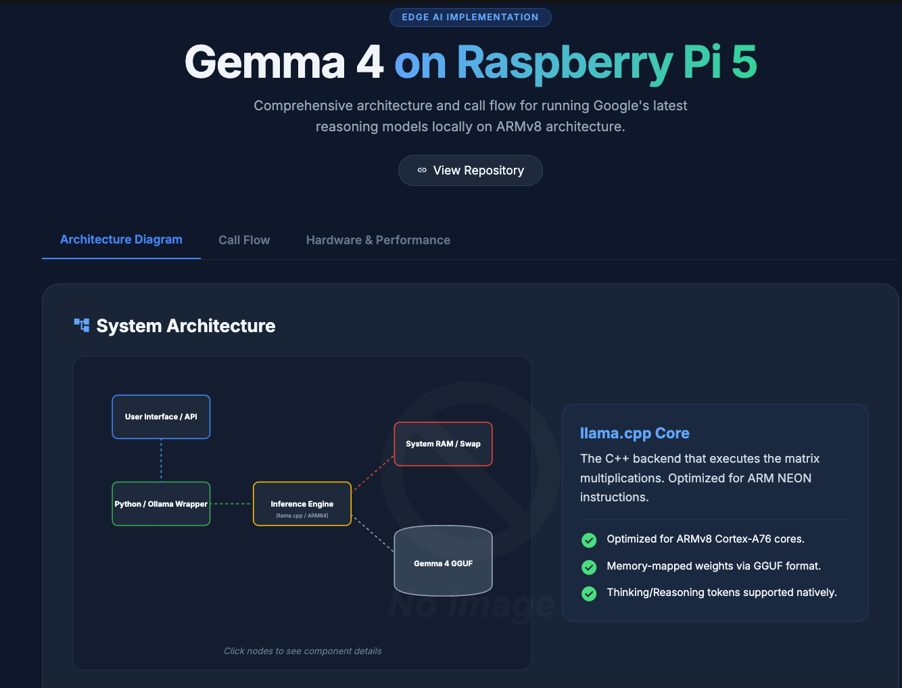
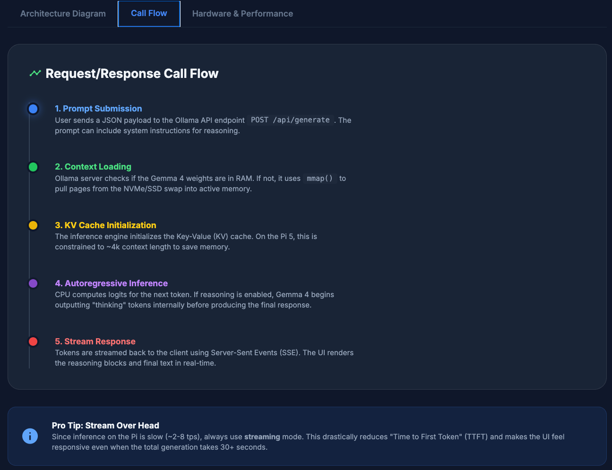
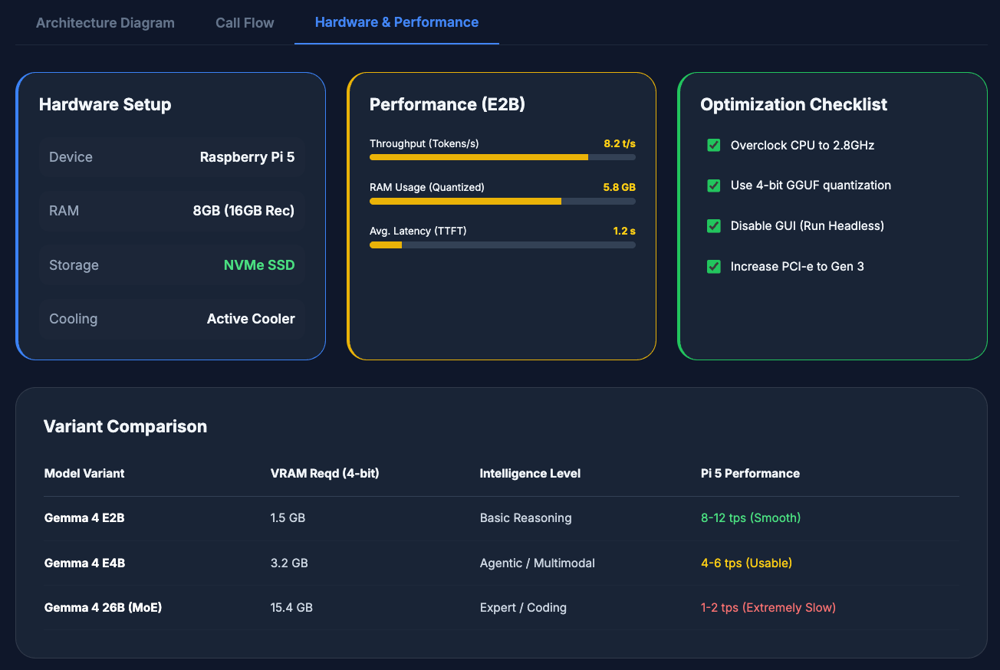

# TelegramBot – Local Ollama on Raspberry PI 5

TelegramBot is a Telegram bot that talks to local LLMs via Ollama.  
It supports:

- Text chat with multi-turn history (per Telegram chat)
- Model switching (`/change_model`, `/see_models`, `/current_model`)
- System prompts & modes (`/set_system`, `/mode`)
- Web-augmented answers using DuckDuckGo (`/web`)
- Summarization and translation helpers
- Basic vision support: send an image and the bot asks a vision model (e.g. `llama3.2-vision`) to analyze it
- Markdown → Telegram formatting (bold, italics, code blocks, etc.)

By design, **no conversation data is persisted to disk**. When you restart the bot, it forgets everything.

## 📸 Architecture Design

Here is the bot in action running fully locally on a constrained environment:

<p align="center">
  
  
  
</p>

---

## Table of Contents

- [Features](#features)
- [Architecture Overview](#architecture-overview)
- [Requirements](#requirements)
- [1. Install Ollama](#1-install-ollama)
- [2. Pull Models](#2-pull-models)
- [3. Create a Telegram Bot](#3-create-a-telegram-bot)
- [4. Clone & Install TelegramBot](#4-clone--install-telegrambot)
- [5. Configure Environment](#5-configure-environment)
- [6. Project Structure](#6-project-structure)
- [7. Running the Bot](#7-running-the-bot)
- [8. Commands](#8-commands)
- [9. Privacy & Security](#9-privacy--security)
- [10. Troubleshooting](#10-troubleshooting)
- [License](#license)

---

## Features

- **Local-first**: all LLM calls go to your local Ollama instance.
- **Telegram-native UX**: slash commands, markdown formatting, inline help.
- **Web search**: `/web <query>` uses DuckDuckGo (DDGS) and feeds results into the LLM for a better answer.
- **Vision**: send an image (with an optional caption) and the bot calls a vision model.
- **Per chat configuration** (in memory only):
  - model
  - system prompt
  - mode
  - temperature
  - max tokens

---

## Architecture Overview

High-level:

- **Telegram** → `python-telegram-bot`
- **Commands & handlers** → Python modules (`telegrambot/commands.py`, `telegrambot/handlers.py`)
- **LLM calls** → Ollama REST API (`/api/chat`)

### TBD
- **Web search** → DDGS (`core/web_tools.py`)
- **Vision** → Ollama vision models (e.g. `gemma4:latest`) with base64 images in the `images` field

---

## Requirements

- Python **3.10+** (recommended)
- Ollama installed and running locally
- A Telegram account + your own bot token from **@BotFather**
- Basic `git` (optional but recommended)

Python dependencies (handled via `requirements.txt`):

- `python-telegram-bot`
- `requests`
- `chatgpt-md-converter`
- `ddgs`

---

## 1. Install Ollama

Go to the official Ollama site and download the installer for your OS: https://ollama.com/

You can check your installation using the command:

```bash
ollama --version
```

Start the Ollama server if it’s not already running.

---

## 2. Pull Models

Pull at least one model.

Example:

```bash
# Text only model (you can pick any you like)
ollama pull melavisions/gemma4


# [TBD] Multimodal model (for text/image analysis)
ollama pull gemma4:latest
```

You can browse available models on Ollama’s model library and in the CLI:

```bash
ollama ls
```

---

## 3. Create a Telegram Bot

1. Open Telegram.
2. Search for **@BotFather** and start a chat.
3. Send `/newbot` and follow the instructions:
   - Choose a display name (e.g. `TelegramBot`)
   - Choose a username ending with `bot` (e.g. `TelegramBot_bot`)
4. BotFather will give you a **bot token**, which looks like:

   ```text
   1234567890:ABCdefGhIjkLmNoPQRstuVwxyz123456
   ```

5. Keep this token secret. You’ll set it as an environment variable in the next steps.

---

## 4. Clone & Install TelegramBot

Clone your fork / this repo and install dependencies:

```bash
git clone https://github.com/skpathak2/gemma4_on_raspberrypi.git
cd telegrambot

# Optional but recommended:
python -m venv .venv
source .venv/bin/activate      # on Linux/macOS
# .venv\Scripts\activate       # on Windows PowerShell

pip install -r requirements.txt
```

---

## 5. Configure Environment

You can configure TelegramBot via environment variables or by editing `telegrambot/config.py`.

### Required

- `TELEGRAM_BOT_TOKEN` – your token from BotFather

### Optional

- `OLLAMA_BASE_URL` – defaults to `http://localhost:11434`
- `OLLAMA_DEFAULT_MODEL` – default text model (e.g. `melavisions/gemma4`)

Example:

```bash
telegrambot/config.py

TELEGRAM_BOT_TOKEN="1234567890:ABCdefGhIjkLmNoPQRstuVwxyz123456"
OLLAMA_DEFAULT_MODEL="melavisions/gemma4"
```


---

## 6. Project Structure

A typical layout looks like this:

```text
telegrambot/
  README.md
  requirements.txt
  main.py

  web/
    __init__.py
    web_tools.py        # DDGS / web search helpers

  telegrambot/
    __init__.py
    config.py           # environment & modes
    state.py            # per-chat config + history (in-memory)
    markdown_utils.py   # markdown -> Telegram HTML
    llm.py              # text chat with Ollama
    vision.py           # image analysis with vision model
    commands.py         # slash command handlers (help, web, etc.)
    handlers.py         # text, photo & unknown handlers + registration
```

If you fork or copy this project, keep this structure so the imports work out of the box.

---

## 7. Running the Bot

From the project root:

```bash
python main.py
```

You should see log output like:

```text
INFO - telegram.ext._application - Application started
```

Now open Telegram, find your bot by its username (e.g. `@TelegramBot_bot`), and send `/start`.

The first message you see is the same as `/help`.

---

## 8. Commands

TelegramBot supports these commands (all per-chat):

- `/help`  
  List all commands and what they do.

- `/see_models`  
  List all models known to the local Ollama server.

- `/current_model`  
  Show the current model used in this chat.

- `/change_model <name>`  
  Switch to another model (e.g. `/change_model llama3.2-vision`).

- `/reset`  
  Clear conversation history for this chat (config is kept).

- `/set_system <text>`  
  Set a custom system prompt. For example:
  ```text
  /set_system You are a helpful bot. Be polite and nice.
  ```

- `/see_system`  
  Show the current system prompt.

- `/mode <name>`  
  Switch between predefined behavior modes (e.g. `default`, `coder`, `translator`, `teacher`).  
  Internally this just swaps the system prompt.

- `/set_temperature <float>`  
  Set creativity level, e.g. `/set_temperature 0.3`.

- `/see_temperature`  
  Show current temperature.

- `/set_max_tokens <int>`  
  Limit how many new tokens the model generates (0 = model default).

- `/see_max_tokens`  
  Show the current `max_tokens` limit.

- `/context`  
  Show a summary of the chat configuration and a preview of the system prompt.

- `/ping`  
  Check that the bot is responsive and see the current model.

- `/summarize <text>`  
  Summarize the provided text (does not affect chat history).

- `/summarize_before`  
  Summarize the last N messages in this chat.

- `/translate <lang> <text>`  
  Translate text into a target language, for example:
  ```text
  /translate english Bonjour tout le monde
  ```

- `/web <query>`  
  Use DuckDuckGo (DDGS) to fetch web results, then pass the results + query into the model.  
  The answer you see is produced by the LLM using those sources. For example:
```text
  /web Who is the current president of the usa?
  ```

### Images

You can also send **images** to the bot:

- Send a **photo** in the chat
- Optional: add a **caption** like:
  - “What does this chart show?”
  - “Translate the text in this image into English.”

The bot will:

1. Download the image temporarily
2. Send it to a vision model (e.g. `gemma3`)
3. Reply with the model’s answer in Markdown (converted to Telegram formatting)
4. Delete the temporary image file after use

---

## 9. Privacy & Security

- Conversation state (history, model choices, system prompts) is kept **in memory only**.
  - When you restart `main.py`, the bot forgets past conversations.
- Telegram messages still go through Telegram’s servers (like any normal Telegram chat).
- No extra data is written to disk beyond:
  - Temporary image files needed to send images to the vision model (in `PERSONALBOT_DOWNLOAD_DIR`), will be deleted immediately after use.
- If you want stricter behavior, you can:
  - Disable the vision handler entirely if you don’t want to store any images even temporarily

---

## 10. Troubleshooting

**Bot doesn’t respond**

- Check that `TELEGRAM_BOT_TOKEN` is set correctly.
- Make sure `python main.py` is running and there are no stack traces in the logs.

**Ollama errors**

- Ensure the Ollama service is running on `http://localhost:11434` (or adjust `OLLAMA_BASE_URL`).
- Verify models are pulled:
  ```bash
  ollama list
  ```

**/web not working**

- Check that `ddgs` is installed (`pip show ddgs`).
- Ensure `core/web_tools.py` is present and importable.
- Some networks / VPNs / DNS filters can block DDG; try again on a different network.

**Images not working**

- Confirm that your selected model is a tool-capable model and that you pulled it:
  ```bash
  ollama pull melavisions/gemma4
  ollama ls
  ```
- Make sure the bot process has permission to write to`PERSONALBOT_DOWNLOAD_DIR`.

---

## License

This project is licensed under the [MIT License](https://mit-license.org/).
